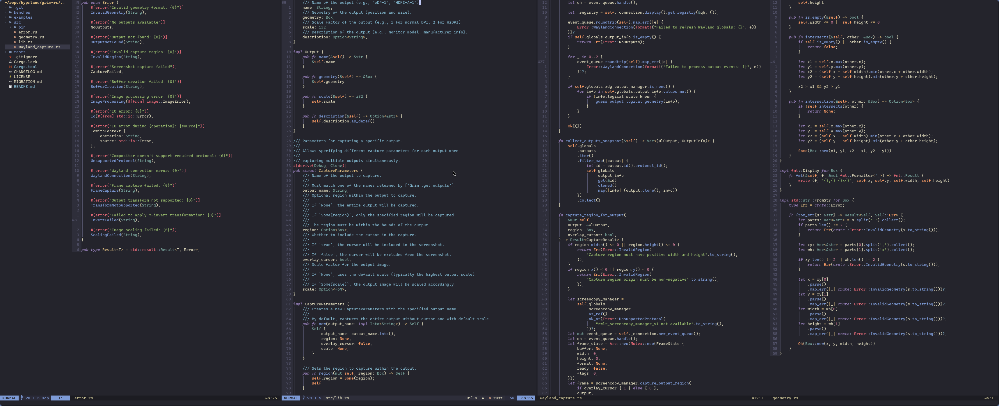

# my config Nvim



## Installation

#### Clone the repository

```shell
git clone https://github.com/vremyavnikuda/nvim.git ~/.config/nvim
```

```shell
sudo rm -rf ~/.config/nvim/.git
```

#### Start Neovim

```shell
nvim
```

## Dependencies

Required

- neovim 0.11+
- git

LSP

- clangd
- rust-analyzer
- gopls

Formatters

- astyle
- rustfmt
- gofmt

Tools

- rg (ripgrep) for Telescope live_grep

Optional

- Nerd Font for nvim-web-devicons icons

## Key Map

- [Keybindings](doc/keybindings.md)
- [キーバインド](doc/keybindings.ja.md)

## Installed Plugins

- [Plugins](doc/plugins.en.md)
- [プラグイン一覧](doc/plugins.ja.md)
